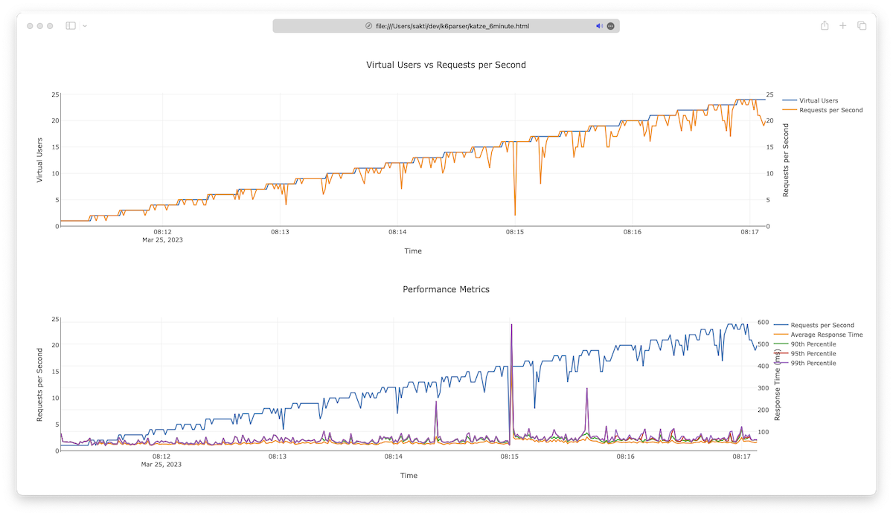

# k6parser



parse k6 result

```
Usage: k6parser [OPTIONS] <FILE>

Arguments:
  <FILE>

Options:
  -o, --output <OUTPUT>
  -h, --help             Print help
  -V, --version          Print version
```


## example

```
$ k6 run --out json=katze.gz katze.js
$ k6parser katze.gz
```


## tested on

```
$ k6 version
k6 v0.43.1 ((devel), go1.20.1, darwin/arm64)
```
